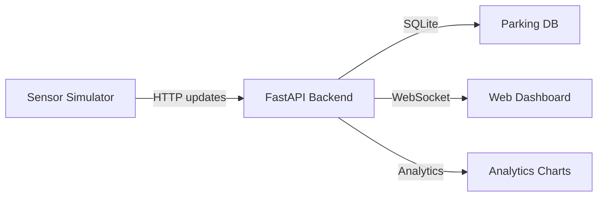
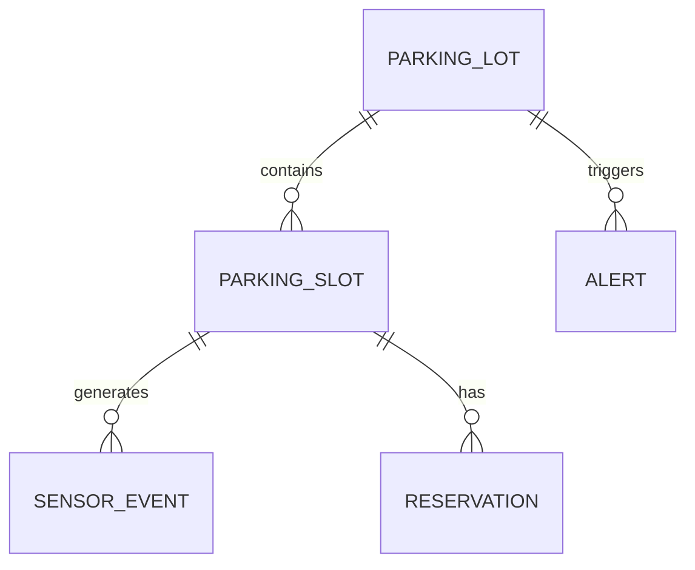

# Advanced Smart Parking System (Simulation)

A full-stack, real-time smart parking system designed for final-year evaluation: live occupancy, reservations, analytics, alerts, and a simulator so demos run without hardware.

## Highlights
- Realtime slot status with WebSocket updates
- Reservation workflow with expiry
- Occupancy analytics + peak hour detection
- Alerting when occupancy exceeds threshold
- Simulator that mimics sensors
- Clean admin controls

## Tech Stack
- Backend: FastAPI + SQLite
- Realtime: WebSocket
- Frontend: Vanilla JS + Canvas charts
- Simulator: Python script (HTTP sensor updates)

## Quick Start
1. Backend
   - `cd smart-parking-sim`
   - `python3 -m venv .venv`
   - `source .venv/bin/activate`
   - `pip install -r backend/requirements.txt`
   - `python3 -m uvicorn backend.main:app --reload`
2. Frontend
   - Open `http://localhost:8000`
3. Simulator
   - `python3 simulator/simulate.py --interval 2 --occupancy 0.6`

## Demo Flow (for marks)
1. Start backend + UI, show realtime grid
2. Run simulator to show live updates
3. Create reservation and explain expiry
4. Change alert threshold and trigger alert
5. Show analytics chart and peak hour

## API Summary
- `GET /api/slots` live snapshot
- `POST /api/sensor/update` simulate sensor input
- `GET /api/records` list sensor records/history (`limit`, `slot_code`, `start_ts`, `end_ts`)
- `POST /api/records` add a sensor record directly
- `POST /api/reservations` reserve a slot
- `GET /api/analytics/occupancy` occupancy analytics
- `POST /api/admin/threshold` update alert threshold
- `GET /api/alerts` view alerts
- `WS /api/slots/live` realtime stream

## Architecture Diagram

## ER Diagram

## Notes
- Replace the simulator with MQTT + ESP32 in real deployment.
- Default lot is created on first run.
